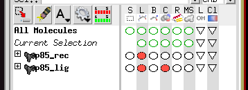

# Preparacion de los input files
Para poder correr  AD4, vamos a necesitar tanto el receptor como los ligandos en formato*.pdbqt, para esto nos podemos ayudar a de *Obabel* y *AutoDockTools* <br>
1. Vamos a definir la estructura de carpetas que necesitamos: <br>
**Importante: siempre reemplazar target por el nombre del receptor** <br>

```
Path/
│
├── target_ligands/
│   ├── ligand1.pdbqt
│   ├── ligand2.pdbqt
│   ├── ...
│   └── ligand58.pdbqt
│
├── target_Dockings/
│   ├── ligand1_target/
│   │   ├── ligand1.pdbqt
│   │   ├── target_rec.pdbqt -> ../../target/target_rec.pdbqt
│   │   ├── target_rec.map1 -> ../../target/target_rec.map1
│   │   ├── target_rec.map2 -> ../../target/target_rec.map2
│   │   └── ...
│   │
│   ├── ligand2_target/
│   │   ├── ligand2.pdbqt
│   │   ├── target_rec.pdbqt -> ../../target/target_rec.pdbqt
│   │   ├── target_rec.map1 -> ../../target/target_rec.map1
│   │   ├── target_rec.map2 -> ../../target/target_rec.map2
│   │   └── ...
│   │
│   └── ...
│
└── target/
    ├── target_rec.pdbqt
    ├── target_rec.map1
    ├── target_rec.map2
    └── ...
```
De estas carpetas, *target_Dockings* va a ser generada automaticamente por un script mas adelante, mientras que las otras dos son necesarias crearlas y poner los archivos. <br>

## Carpeta Target_ligands:
En esta carpeta necesitamos poner los ligandos separados en formato *.pdbqt, esto lo vamos a hacer con openbabel, suponiendo que tenemos la base de datos en formato *.mol2 todos juntos: <br>
```
obabel -imol2 baseDeDatos.mol2 -osdf -O ligand.pdbqt -m
```
Esta linea correrla en consola dentro de la carpeta Target_ligands. El output sera N archivos llamados ligand1.pdbt a ligandN.pdbqt (N siendo el tamaño de la base de datos) <br>

**Importante: si se usa IX para PRC, usar la base de datos numerada con el IX, sino se puede usar el nombre del file ya numerado.**

## Carpeta Target:
Para llenar esta carpeta, vamos a necesitar usar *AutoDockTools* y el receptor previamente preparado (con sus respectivas cargas, aguas eliminadas, sin H y todo) <br>
1. File > Read Molecule > seleccionar la molecula .mol2 o .pdb puede ser tambien
2. Grid > Macromolecule > Choose > seleciconar el receptor > yes > ok > ok > guardar en la carpeta Target <br>

Ahora el siguiente paso es correr **AutoGrid**, el ejecutable lo pueden encontrar en [AutoGrid y AutoDock](docs/autodocksuite-4.2.6-x86_64Linux2.tar): <br>
1. Abrir el ligando (cristalizado en el sitio de union) en ADTools: Ligand > input > open > selccionar ligando > ligand > output > save as .pdbqt
2. **Preparar el Grid**: Grid > Set Map Types > Choose Ligand > Seleccionar el ligando > select ligand
3. Grid > Grid box
4. Center > center on ligand
5. Cambiar "Spacing (angstrom)" a 1
6. Hacer display del ligando en spheres para poder ver los limites de la caja, achicas la caja hasta los limites del ligando dejando un margen. Anoten el centro de masa de masa y el tamaño de la caja (les va a servir para el resto de los programas de docking)
   <p align="center"> 
</p>
<p align="center">
    
</p>
7. File > Close saving current <br>
8. Grid > output > Save GPF > guardar como a.gpf <br>
9. Docking > Macromolecule > Srt Rigid filename > seleccionar el target.pdbqt <br>
10. Docking > ligand > Choose > ligand > seleccionar el ligando.pdbqt > aceptar todo lo "random" <br>
11. Docking > Set parameters > Genetic Algorithm > Accept (dejar los vaores default) <br>
12. Docking > docking parametrs > accept <br>
13. Docking > Output > LamarkianGA(4.2) > guardar como a.dpf <br>

Despues de hacer todos estos pasos, vamos a tener 4 archivos: **Target.pdbqt, Ligand.pdbqt, a.gpf and a.dpf**


